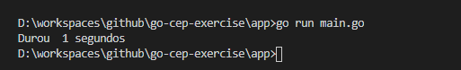

# The GoCep :sunglasses:

- Learning golang, Exercise to execute a rest API and register a response into a file

## Give a Star! :star:

If you liked the project, please give a star ;)

## You need some of the fallowing tools :exclamation:

-  GoLang

## Description :books:

- Go is an open source programming language that makes it easy to build simple, reliable, and efficient software

### Startup ✔️

```go
go run main.go
```

### Telemetry ❗




**Official documentation** [Redirect](https://blog.golang.org/)
